# Zero Point

A survival game for Windows, written from scratch in C++20 on Direct3D 11. There is no game engine underneath and no third-party code library: the renderer, netcode, physics, audio mixer, UI and asset baker are all part of this repository.

You wake up on the shore of a large abandoned island with nothing but your hands. Gather, craft, farm, build a base, make junk guns, ride the freight train, and try to stay alive. It is online only: a dedicated server owns the world and every client predicts and mirrors it.

> **Status: early development.** This is a work in progress that changes every day. Expect bugs, crashes, placeholder art, unfinished systems, missing features and saves that break between versions. Nothing here is final.

## Screenshots

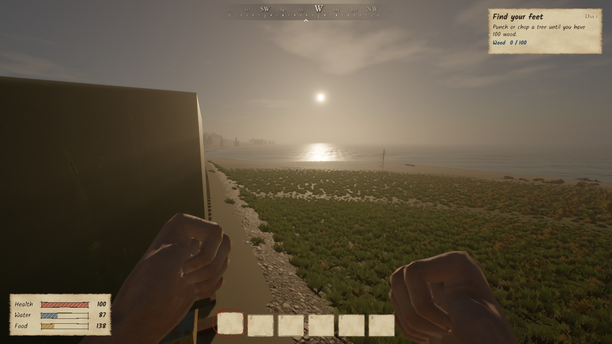

| | |
|---|---|
| 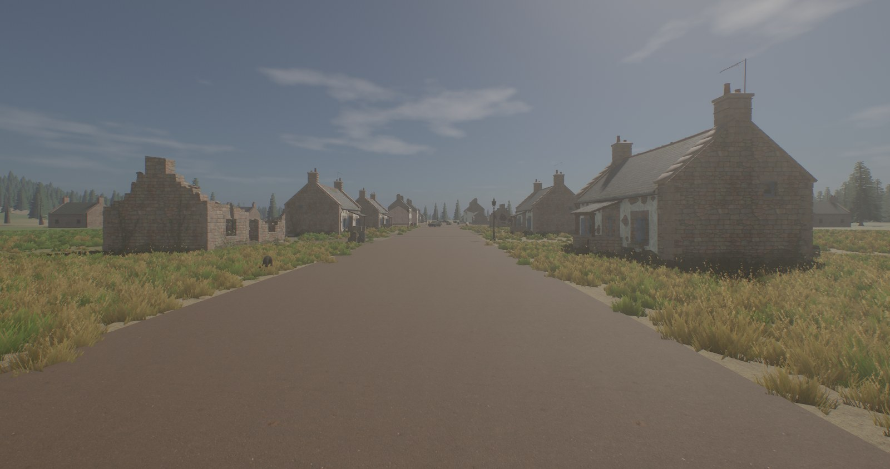 | 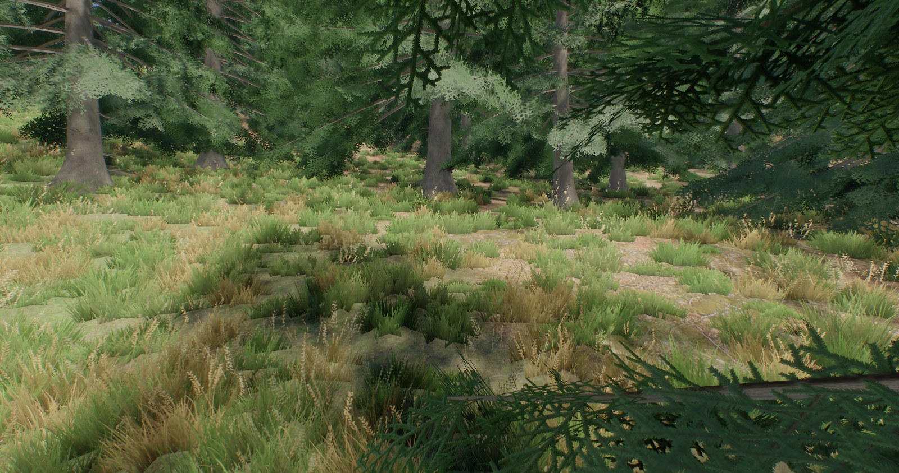 |
| 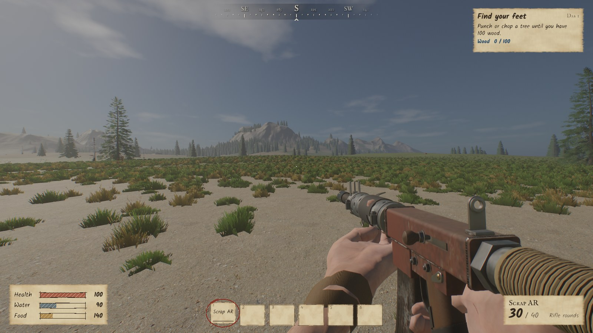 | 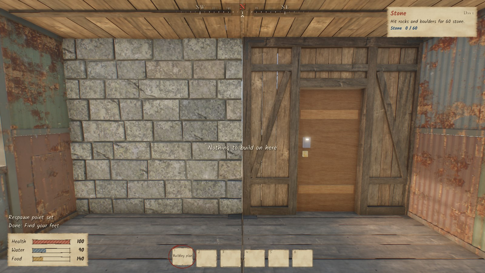 |
| 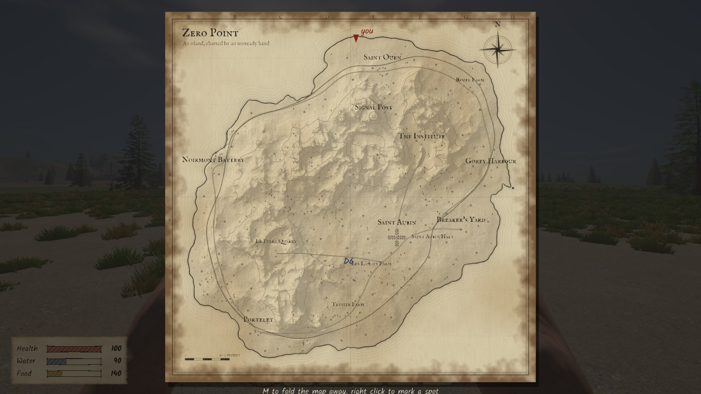 | 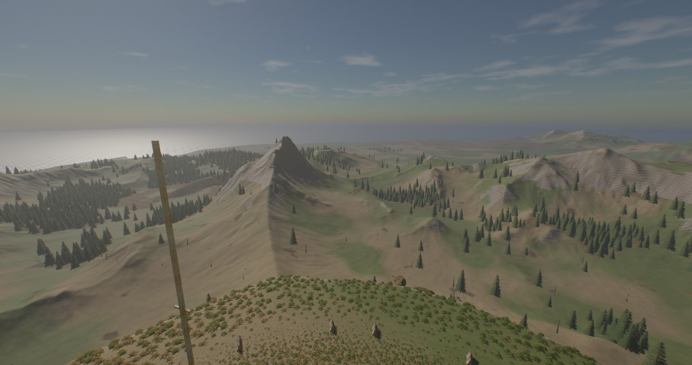 |
| 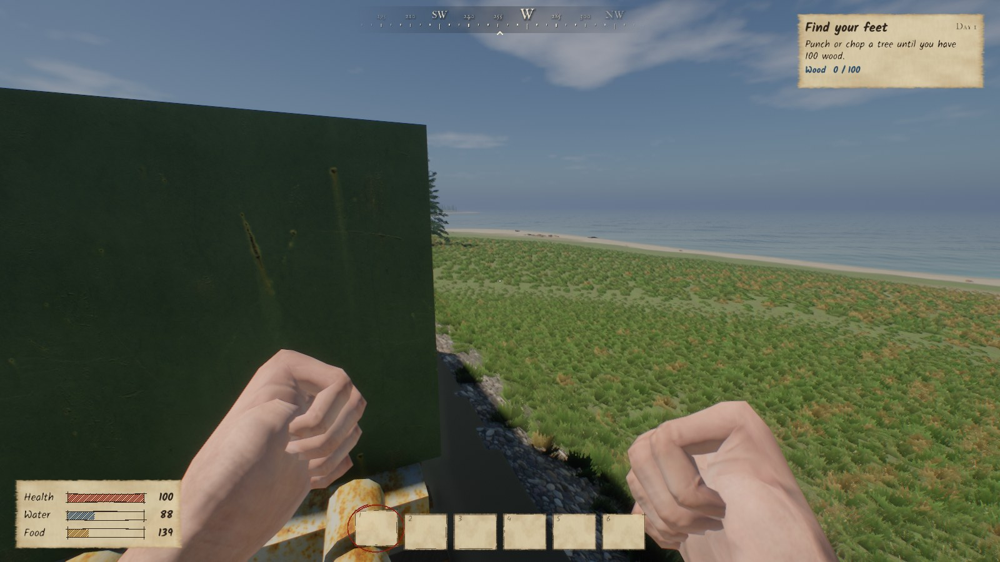 | 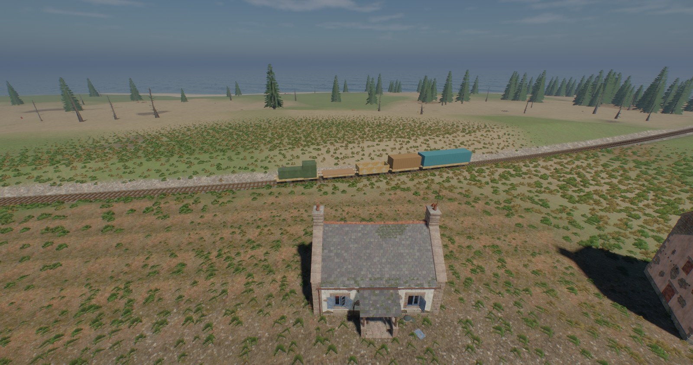 |
| 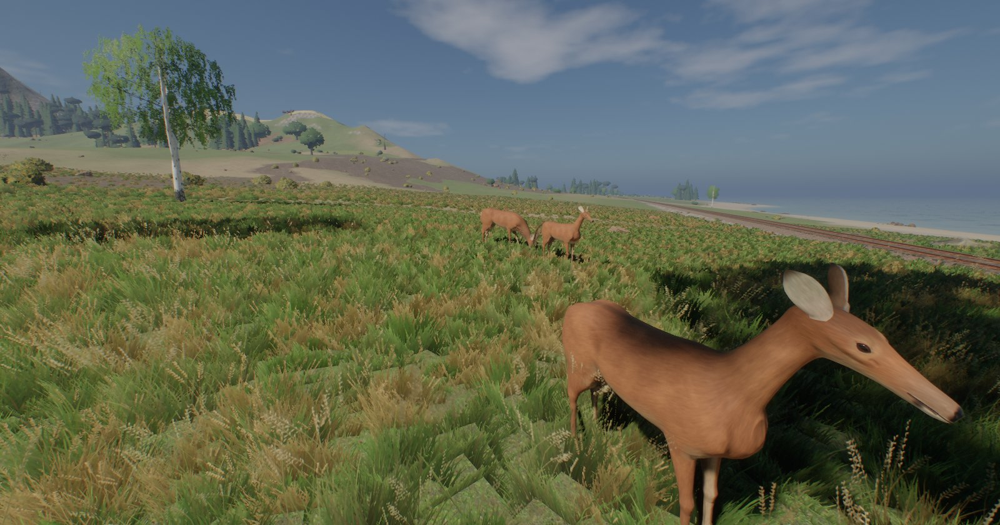 | 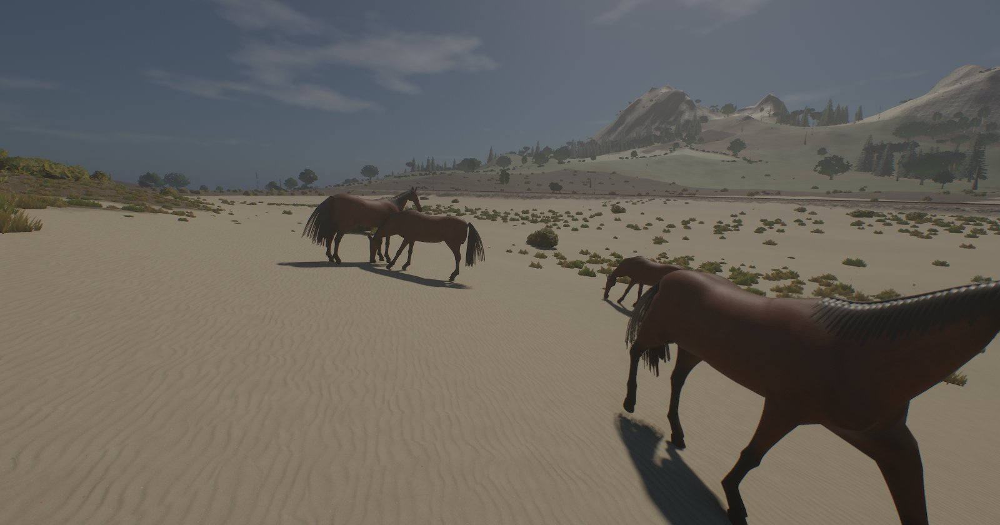 |
| 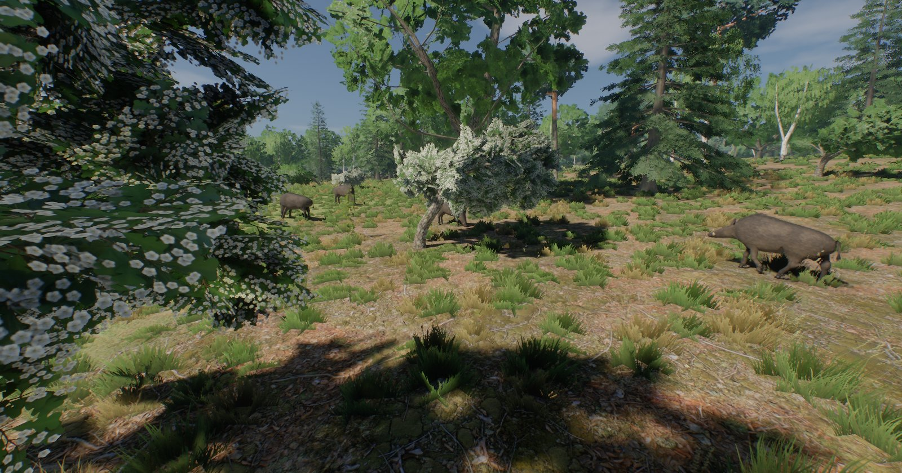 | 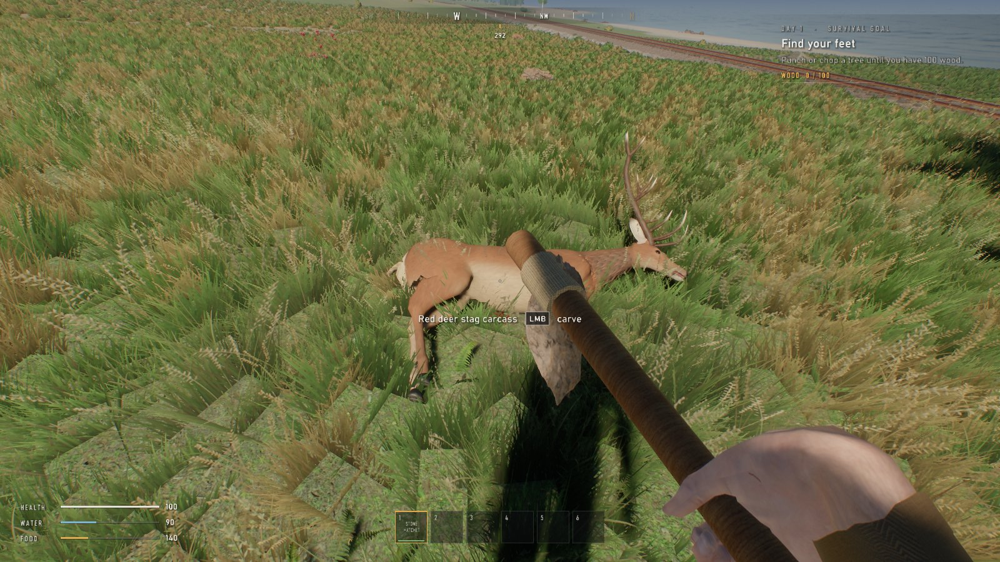 |
| 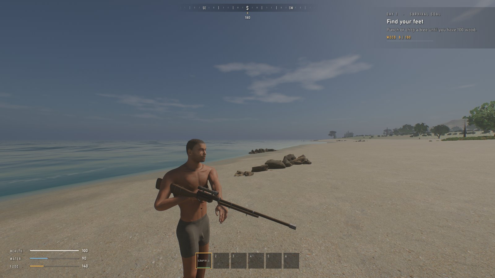 | 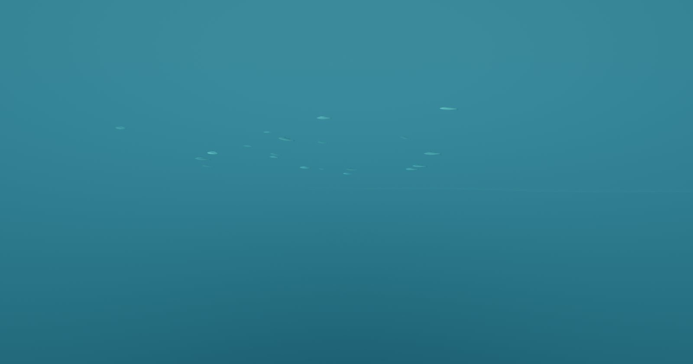 |
| 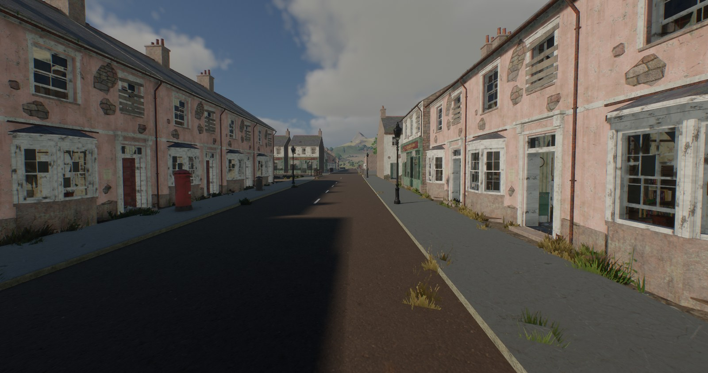 | 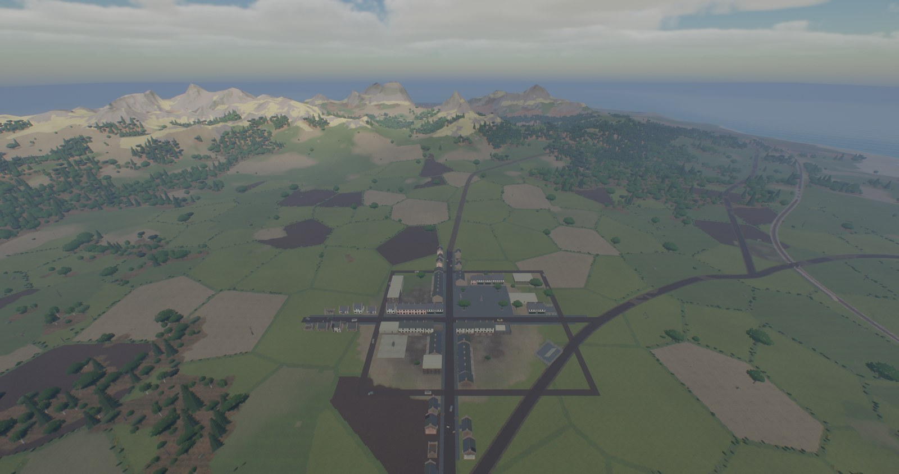 |
| 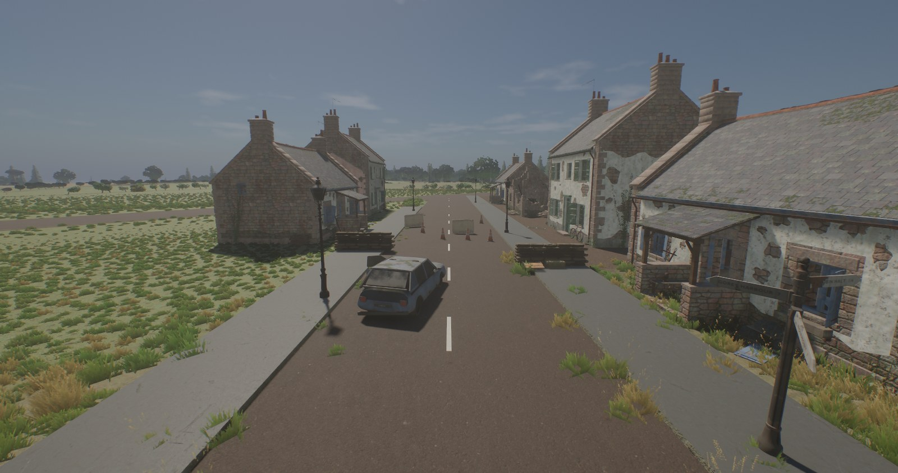 | 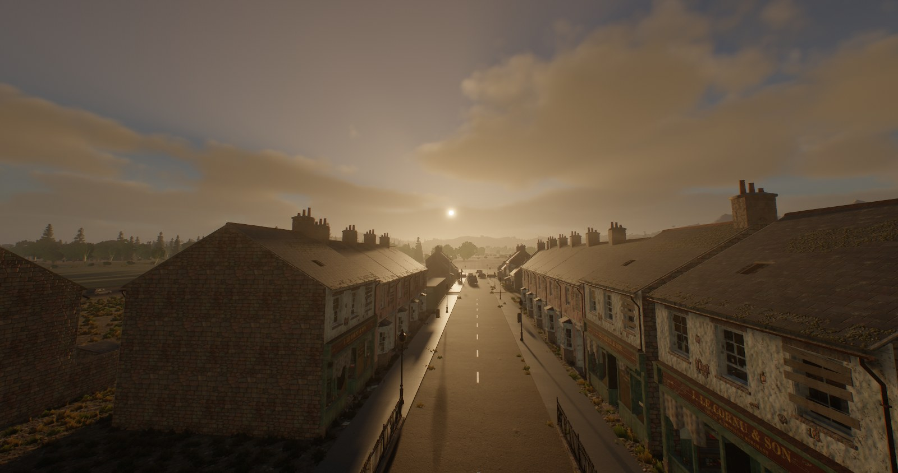 |

These shots still show the old placeholder train; the Blender-built locomotive, wagons and coach have replaced it in the game since. More screenshots will be added as the world fills in.

## What is in the game so far

**World**
- A 9.4 square kilometre island (4608 m terrain, 1 m height samples) shaped by noise and hydraulic erosion, with continuous level of detail
- 13 named places (a ruined town, villages, farms, a harbour, a quarry, a signal post on the summit), roads, and a 10 km closed railway loop
- A train on a fixed timetable (locomotive, flat, open and box wagons and a passenger coach, all modelled in Blender, with spinning wheels and working lamps) that you can climb onto, walk around on and ride, and that will kill you if you stand on the track
- Stations along the line: platforms at every stop, station buildings, a signal box, a water tower and signals, plus level crossings whose gates swing shut with flashing lamps before the train comes through
- Twelve biomes (beach, dunes, marsh, meadow, farmland, woodland, pinewood, heath, moor and more), each with its own ground and trees (oak, birch, Scots pine, fir, hawthorn, willow, gorse), hedgerows around the fields, and roads that follow the terrain
- Bullet holes, blood and footprints that are kept on the server and shown to everyone nearby
- Gulls wheel over the coast and crows over the fields and woods, flapping and gliding, and a gunshot sends them climbing away. Schools of mackerel and sea bass swim offshore and scatter when you swim close
- Day and night cycle with a procedural sky, weather (overcast, rain, storms with lightning), an ocean you can swim and dive in
- Volumetric clouds that drift with the wind, glow gold at sunrise and sunset, let sunbeams through their gaps and cast moving shadows over the land and the sea
- Buildings modelled in Blender with interiors, collision and loot spots
- Saint Aubin, a planned town: the High Street and Rue de la Mer cross at a square with a war memorial, market stalls, a horse trough, oaks in raised planters, iron bollards and benches, a ring of back lanes behind the blocks, kerbed pavements with street lamps, pillar boxes, finger posts and guard railings at the crossroads, rows of furnished Victorian terraced houses and high street shops with flats above, and a corner pub on the square with a furnished bar and rooms upstairs. A church, hall, police station, clinic, school, garage, flats and a fuel station are being modelled one by one and fill their plots as they arrive; until then plain stand-ins hold their places
- Sandbag checkpoints with traffic cones and concrete barriers at the edges of town, burnt out hatchbacks, saloons and vans in the streets, and junk in the yards, with loot to find: crates behind the sandbags, goods left on the market stalls

**Vehicles**
- An armoured junk rover and a scrap helicopter you can drive and fly, with a seat for a passenger. The Blender models are on the way; simple stand-ins are in the game until then
- Simulated on the server: sprung wheels with tyre grip, weight transfer and a handbrake for the rover, and a rotor that spools up, holds height and climbs at a set rate for the helicopter. The driver's game predicts every input so steering feels instant, and everyone else sees the vehicle move smoothly
- Bullets and crashes damage the hull, hard crashes hurt the people inside, damaged vehicles smoke and wrecks burn out and come back after a while. Headlights come on after dusk

**Survival**
- Health, food, water, breath, body temperature and wetness
- Chopping trees, mining rock and ore, picking plants, looting containers
- Crafting with a recipe list and research, a 30 slot inventory and a belt
- Farming with seeds, water and crop growth, campfire cooking, wells
- Base building in four tiers (twig, wood, stone, metal) with doors, code locks, tool cupboards, decay and repair
- Crafted junk guns (pipe pistol, scrap rifle, scrap assault rifle) that jam, misfire and overheat, plus a hunting bow
- Ragdoll deaths: bodies crumple under gravity, get knocked back by the shot that killed them and come to rest over kerbs, steps and props
- You wake up with nothing, not even clothes. A "Censor nudity" setting puts every survivor, you included, in underwear instead
- Hunting: herds of red deer, wild boar and wild horses roam the island by biome. They graze, rest, stare when they hear you and bolt when you get close, and a cornered boar will charge. Crouching lets you stalk closer. Shot placement matters: a head or heart shot drops an animal, a gut shot sends it running until it bleeds out, leaving a blood trail to follow. Carve the carcass for meat, hide, fat and bone
- A hand-drawn ink map with pins, and a compass

**Interface**
- Main and pause menus over the live island, a server browser with direct connect, a field guide that shows your own key bindings, and credits
- Eight pages of settings (display, graphics, audio, controls, key bindings, gameplay, interface, accessibility), with a quality preset, a short explanation and the performance cost of every option, and a 15 second check before a new display mode is kept
- A realistic heads-up display: no ammo counter, no weapon name and nothing that tells you what you are holding. The belt appears for a moment when you switch, and health, water and food only show while they are low or changing
- Colour blind filters, reduced flashing, reduced camera motion, interface scaling, adjustable head bob, and hold or toggle for crouch, aim and sprint

**Multiplayer**
- Dedicated server, server-authoritative movement with client prediction and reconciliation
- Lag compensated hit detection, sleepers, loot bags, persistence of players and the world
- Players with the same name can join the same server: later arrivals get a number, like "Sam (2)", and nobody can take over someone else's saved character
- You can see what other players are holding: rifles carried at low ready with both hands on the gun, pistols in two hands, tools at the hip, a bow in the left hand
- Animals are simulated on the server and shared with everyone nearby, so a herd you spook bolts for every player at once
- Dedicated servers are built to sit idle cheaply: an empty server rests at two ticks a second and uses no measurable CPU, a busy one wakes only for its 30 ticks and 20 snapshots a second however many players are on, herds far from every player update twice a second, and render-only data is freed after the world loads (about 55 MB of private memory)
- Admin tools: bans, whitelist, password, chat commands

**Technology**
- Deferred renderer: tiled compute lighting, cascaded shadows, ambient occlusion, temporal anti-aliasing, auto exposure, bloom, image based lighting
- Raymarched volumetric clouds from noise the game generates on the graphics card at start up, rendered at half resolution with temporal smoothing, plus a cloud shadow map for the ground and the sea
- GPU skinned characters, instanced foliage with impostors, GPU grass, screen-space reflections on water
- Full-body first person: look down and you see your own legs and feet, and your shadow is your whole body
- Brush and heightfield collision with swept box traces, moving platforms
- Positional audio on XAudio2 with occlusion, distance delay, echoes, reverb zones and Doppler
- Gunshots built from real firearm recordings: a close layer for other players, a separate layer for your own gun, the action, a distant report and stereo tails shaped by real impulse responses
- An offline asset baker (texture compression, mesh simplification, terrain generation, font atlases) that packs everything into one file
- Blender Python pipelines that generate guns, trees, grass, buildings and characters

## Numbers

Counted on 8 October 2026. Build output, the portable Blender install and binary assets are not included in these counts.

| Language | Files | Lines |
|---|---:|---:|
| C++ source (.cpp) | 79 | 48,277 |
| C++ headers (.hpp) | 69 | 11,092 |
| HLSL shaders | 20 | 4,352 |
| Python asset tools | 94 | 57,323 |
| Batch | 1 | 135 |
| **Total** | **263** | **121,179** |

| Part of the game | Files | Lines of C++ |
|---|---:|---:|
| Gameplay (`game`) | 46 | 19,027 |
| Engine core (`core`) | 8 | 10,211 |
| Renderer (`render`) | 50 | 9,602 |
| Asset baker (`tools/baker`) | 15 | 7,215 |
| Networking (`net`) | 12 | 6,663 |
| Interface (`ui`) | 8 | 4,649 |
| Audio (`audio`) | 2 | 1,238 |
| Utilities (`utils`) | 4 | 610 |

Other numbers: about 290 texture sets, 281 sounds, 2 kinds of vehicle, 13 landmarks, 5 stations, 4 level crossings, 10 km of railway, 8 roads and tracks, 7 kinds of tree, about 130 animals in 31 herds plus some 430 birds and fish, 55 settings and 17 rebindable keys, 60 Hz simulation, up to 500 players per server.

## Building

Requirements:
- Windows 10 or 11, 64 bit
- Visual Studio 2022 with the C++ desktop workload (the script finds the compiler by itself)
- Git LFS, because textures, models and sounds are stored with it

```
git lfs install
git clone https://github.com/tokenizestring/zero_point.git
cd zero_point
build.bat
```

`build.bat` compiles the asset baker, bakes `assets` into `build\bin\zero_point.pak`, compiles the shaders and links the game and the server. The first bake takes a few minutes.

- `build.bat code` rebuilds only the code and shaders
- `build.bat terrain` rebuilds only the terrain cache and writes a preview image
- `build.bat debug` makes a debug build

## Running

Start a server, then the game:

```
build\bin\zero_point_server.exe --name "My island"
build\bin\zero_point.exe
```

Choose Play and pick the server from the browser, or join directly with `zero_point.exe --connect 127.0.0.1`.

Default keys: WASD to move, Shift to sprint, Ctrl to crouch, Space to jump, Tab for the inventory, M for the map, E to use, R to reload, I to inspect the held gun. Keys can be changed in the settings, and the field guide in the menu always lists the current ones.

## Repository layout

| Folder | Contents |
|---|---|
| `core` | Application loop, platform layer, maths, and `engine.hpp` with every constant and data structure |
| `render` | Direct3D 11 renderer, terrain, water, foliage, characters, sky, post processing |
| `game` | Movement, survival, harvesting, building, farming, weapons, the train, maps |
| `net` | Transport, server, client, persistence, admin tools |
| `ui` | Menus and settings, the HUD, the ink map, and the widget kit they share |
| `audio` | The mixer |
| `shaders` | HLSL |
| `tools/baker` | The offline asset baker |
| `tools/convert` | Blender and Python scripts that generate or convert assets |
| `assets/raw` | Everything the baker reads: textures, models, characters, animations, sounds, skies |
| `assets/source` | Inputs for the generator scripts |

The generator scripts expect a portable Blender 4.5 in `tools/blender`. It is not part of the repository.

## Roadmap

See [roadmap.md](roadmap.md). Next up: animals and hunting, fish and birds, guards at the landmarks, boats, clothing, new player characters.

## Credits

Third-party assets and their licences are listed in [CREDITS.md](CREDITS.md).
